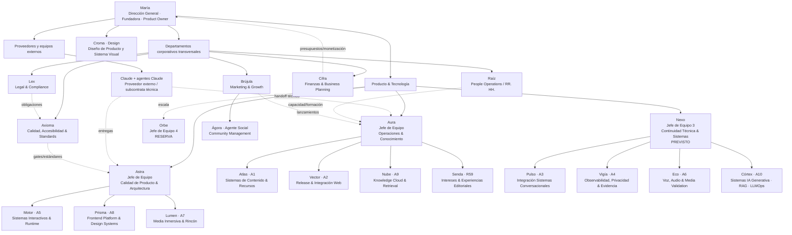

# ORGANIGRAMA DE IRIS GREEN · R01

Fecha: 30/09/2026  
Autoridad: María  
Issue: #346  
Estado: `ORGANIGRAMA_EMPRESA_R01_ADOPTED`

## Principio

Iris Green se organiza ya como una empresa/proyecto profesional con:

- Dirección General;
- Producto y Tecnología;
- departamentos corporativos transversales;
- especialistas;
- jefaturas con límite de carga;
- Formación profesional obligatoria;
- continuidad entre chats.

Los alias son nombres de proyecto. No implican género.

## Organigrama visual

## Dirección General

### María
Puesto:
**Dirección General · Fundadora · Product Owner**.

Responsabilidad:
- visión;
- producto;
- prioridades;
- decisiones irreversibles;
- HUMAN QA final;
- estrategia empresarial;
- activación de monetización/mercado.

No se obliga a María a resolver decisiones técnicas que pertenecen a profesionales del equipo.

## Producto & Tecnología

### Aura
**Jefe de Equipo · Coordinación Operativa y Gestión del Conocimiento.**

Responsabilidad:
- continuidad;
- órdenes;
- Formación;
- carga;
- handoffs;
- preservación;
- coordinación entre departamentos;
- drift operativo.

### Astra
**Jefe de Equipo · Calidad de Producto, Arquitectura y Gates.**

Responsabilidad:
- arquitectura;
- revisión técnica/producto;
- QA de producto;
- gates;
- precedencia;
- aceptación previa a HUMAN QA.

Astra NO debe convertirse en el ejecutor que arregla repetidamente el trabajo de un subordinado.

### Nexo
**Jefe de Equipo · Continuidad Técnica y Sistemas.**

Estado:
previsto para activación.

Absorberá especialistas de sistemas para descargar a Aura/Astra.

### Orbe
**Jefe de Equipo de reserva de escala.**

Solo se activa cuando:
- >12 trabajadores activos;
- las 3 jefaturas llegan al límite;
- o la carga P0/P1 hace inviable la revisión correcta.

### Córtex · Agente 10

Puesto:
**LLM / Generative AI Systems Engineer**.

En español:
**Ingeniero de Sistemas de IA Generativa y Conocimiento**.

Especialización:
- AI Agent Engineering;
- RAG;
- Knowledge Engineering;
- LLMOps;
- model/provider integration;
- context engineering;
- tool orchestration;
- evals;
- safety-aware generation.

Misión Sabik:
- estudiar la integración actual con Claude API;
- diseñar migración controlada a OpenAI;
- decidir arquitectura de modelo/API con evidencia;
- consumir la biblioteca de Nube sin duplicarla;
- diseñar instrucciones, contexto, tools y evaluaciones;
- gobernar qué conocimiento puede llegar al modelo;
- medir calidad, latencia, coste y fallos;
- mantener provider/model como componente versionado, no hardcode opaco.

Fronteras:
- Nube/A9 = biblioteca, corpus, fuentes, citas, safety, updater;
- Córtex/A10 = modelo, provider, agentes, RAG consumption, context, evals, LLMOps;
- Pulso/A3 = runtime conversacional y conexión operativa;
- Vector/A2 = integración/release web.

No migra Sabik durante la jornada de Formación.

## Departamentos corporativos transversales

Los departamentos no se cuentan dentro del cap 4 de una jefatura de Producto & Tecnología.
Sus responsables reportan a Dirección General y trabajan transversalmente con las jefaturas.

### Lex · Departamento Legal & Compliance

Puesto:
**Director/a de Legal & Regulatory Compliance**  
(alias sin género obligatorio).

Misión:
identificar qué leyes/regulaciones son aplicables y traducirlas en obligaciones claras para el proyecto.

Ámbitos:
- protección de datos y privacidad;
- RGPD/LOPDGDD y normativa conexa;
- cookies/almacenamiento/terceros;
- menores;
- IA/Sabik y regulación aplicable;
- accesibilidad como obligación legal;
- propiedad intelectual, copyright y licencias;
- marcas;
- contratos/condiciones/avisos;
- proveedores/encargados/subencargados;
- transferencias internacionales;
- retención/borrado;
- derechos de usuarios;
- incidentes/brechas;
- términos de uso;
- normativa de libros/educación/comercio cuando aplique.

Regla:
Legal determina **qué obligación aplica**.
No inventa certificaciones.
Interpretaciones de alto riesgo que requieran representación/asesoramiento profesional humano se escalan.

### Raíz · Recursos Humanos / People & Organization

Puesto:
**People Operations & Organizational Development Lead**.

Misión:
asegurar que tenemos la gente, capacidades, reparto y aprendizaje necesarios.

Ámbitos:
- inventario de personal/agentes;
- puestos;
- skills matrix;
- carga de trabajo;
- capacidad;
- necesidad de nuevos agentes;
- onboarding;
- Formación;
- continuidad entre chats;
- encuestas internas;
- clima de equipo;
- bloqueos organizativos;
- rendimiento del proceso, no vigilancia personal;
- planes de aprendizaje;
- sucesión;
- vacantes;
- diseño de equipos/jefaturas.

Debe responder:
“¿Tenemos a la persona/rol correcto, con la formación correcta y una carga sostenible?”

### Axioma · Calidad, Accesibilidad & Standards

Puesto:
**Quality, Accessibility & Standards Director**.

Misión:
convertir estándares y requisitos de calidad en controles verificables.

Ámbitos:
- WCAG;
- W3C COGA;
- EN 301 549;
- ISO/IEC 40500;
- ISO 24495-1;
- familia ISO 9241 aplicable;
- PDF/UA;
- Lectura Fácil/UNE cuando corresponda;
- Braille cuando corresponda;
- accesibilidad cognitiva;
- calidad web/software;
- matrices de requisitos;
- criterios PASS/FAIL;
- auditorías;
- CAPA/correcciones;
- evidencias;
- gestión de versiones de normas;
- evitar afirmar conformidad/certificación sin base.

Separación:
- **Lex**: “¿es legalmente obligatorio y en qué condiciones?”
- **Axioma**: “¿cómo lo implementamos, medimos y demostramos?”

Axioma colabora estrechamente con Astra pero no sustituye el HUMAN QA de María.

### Brújula · Marketing & Growth

Puesto:
**Marketing, Growth & Product Communications Director**.

Misión:
crear conocimiento, demanda, comunidad y adopción sin degradar los valores de Iris Green.

Líneas actuales:
1. **Iris Green web gratuita**;
2. **Sabik IA**;
3. **Sabik Educa**;
4. **Libros de Iris / Iris Green**.

Ámbitos:
- estrategia de marca;
- posicionamiento;
- campañas;
- lanzamientos;
- SEO/descubrimiento orgánico;
- contenido promocional;
- partnerships;
- prensa;
- comunidades;
- producto/mercado;
- newsletters cuando existan;
- eventos/educación;
- métricas de adquisición y retención;
- investigación de audiencias.

Ágora/Agente Social reporta funcionalmente a Brújula.

Marketing NO convierte datos sensibles de salud/neurodiversidad en targeting invasivo.

### Cifra · Finanzas & Business Planning

Puesto:
**Finance & Business Planning Director**.

Estado actual:
fundacional / baja actividad hasta fase de monetización.

Misión:
dar visibilidad económica y preparar crecimiento sostenible.

Ámbitos futuros:
- costes;
- presupuestos;
- forecasting;
- cash flow;
- runway;
- coste de infraestructura/IA/Cloud/media;
- unit economics;
- escenarios de monetización;
- precios;
- márgenes;
- ingresos;
- P&L;
- inversión;
- ROI;
- riesgos;
- planificación financiera;
- coordinación contable/fiscal con profesionales humanos cuando corresponda.

Antes de monetizar:
puede construir el inventario de costes y escenarios, sin fijar todavía precios comerciales por su cuenta.

## Design

### Croma
**Especialista de Diseño de Producto y Sistema Visual.**

Permanece bajo dirección directa de María cuando ella lo determine.

Design:
- no sustituye la web;
- entrega componentes/arte;
- se adapta al producto vivo;
- coopera con Prisma/Astra/Vector.

## Límite de carga

Jefaturas Producto & Tecnología:
- máximo 4 activos;
- 5 solo si uno está HOLD/bloqueado/cierre;
- máximo recomendado 2 P0/P1 simultáneos.

Departamentos corporativos tienen su propia capacidad.
Si un departamento crece, crea su propio equipo antes de sobrecargar a una jefatura técnica.

## Estado de reparto técnico

### Aura · 4
- Atlas;
- Vector;
- Nube;
- Senda.

### Astra · 3 + 1 vacante interna
- Motor;
- Prisma;
- Lumen;
- vacante interna.

### Nexo · 4/4 previsto
- Pulso;
- Vigía;
- Eco;
- Córtex.

Ágora deja el cupo técnico de Aura y pasa a Marketing/Brújula.

## Proveedores y equipos externos

### Claude + agentes/sesiones de Claude

Clasificación operativa:
**equipo externo / subcontrata técnica**.

No forman parte de la plantilla interna de Iris Green/Sabik IA Technology.

Reglas:
- no consumen plazas del cap de las jefaturas internas;
- no son miembros del Slack interno por defecto;
- no reciben acceso general a canales/departamentos internos;
- trabajan mediante orden/acuerdo de alcance;
- solo reciben la información necesaria para ejecutar el encargo;
- entregan por GitHub/handoff/artefactos;
- sus entregas pasan revisión interna antes de aceptación;
- no toman decisiones de producto irreversibles;
- HUMAN QA y aceptación final permanecen en Iris Green.

Flujo:

`ORDEN → ALCANCE → ENTREGA EXTERNA → HASH/HANDOFF → REVISIÓN INTERNA → CORRECCIÓN SI PROCEDE → HUMAN QA/APROBACIÓN`

La palabra “subcontrata” se usa aquí como clasificación operativa.
La naturaleza contractual/jurídica real la determinará Lex cuando exista relación contractual formal.

### Slack

Slack `Sabik IA Technology` es infraestructura **interna**.

Proveedores externos:
- no entran por defecto;
- si un proyecto requiere colaboración directa, usar canal externo específico y principio de mínimo acceso;
- decisiones finales se consolidan igualmente en GitHub.

## Revisión posterior

Este organigrama es R01.
Después de crearlo se revisará qué funciones faltan antes de abrir más agentes/departamentos.
